# ros_websocket-client

ROS において Pub/Sub を構成し、Python で Subscriber 兼 WebSocket クライアントを実装する。

## Usage

### Install

```
docker pull chronushadow/ros-ws-client
```

### Run

```
docker run -it --rm chronushadow/ros-ws-client
```

## Architecture

### フレームワーク／ライブラリ

Pub/Sub ノードの生成やノード間メッセージのやり取りを実装するため、ROS に対する Python クライアントライブラリ [rospy](http://wiki.ros.org/rospy) を利用する。

また、WebSocketクライアントを実装するため、[websocket-client](https://github.com/websocket-client/websocket-client) を利用する。

### マルチスレッド処理

Pub/Sub の Subscriber および WebSocket クライアントは、それぞれ常駐して処理待ちとなるため、同じスレッドで扱うことができない。

そこで、[threading](https://docs.python.jp/2.7/library/threading.html) モジュールを利用して WebSocket クライアントを別スレッドで処理する（マルチスレッド）。

スレッドの生成から `subscribe`, `ws.send` 等の処理シーケンスは以下のとおり。



